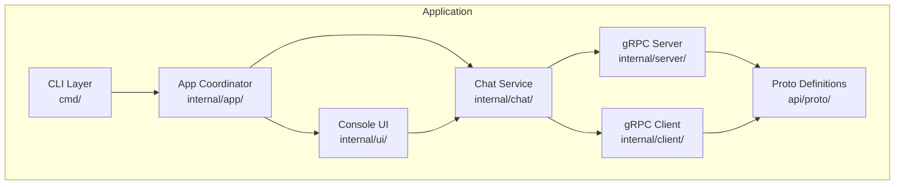
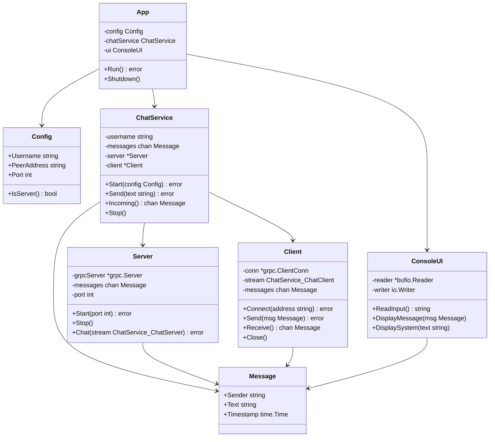
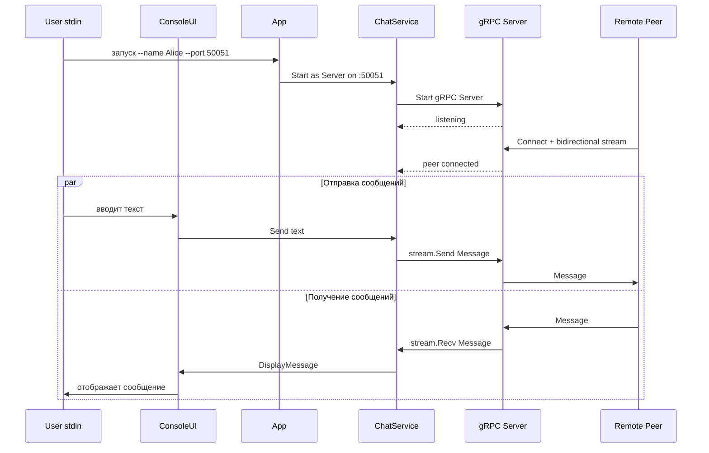
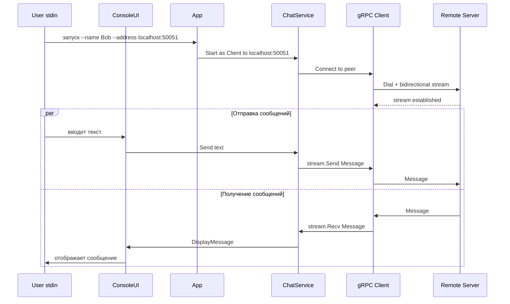

# Архитектурная документация — P2P gRPC Chat

## 1. Обзор проекта

**Название:** P2P консольный чат на gRPC  
**Язык:** Go  
**Авторы:** Токарев Алексей, Деружинский Дмитрий  
**Лицензия:** MIT  

### 1.1 Назначение

Консольное приложение для обмена текстовыми сообщениями (Unicode) между двумя пирами по протоколу gRPC. Каждый экземпляр приложения может работать в двух режимах:

- **Сервер** — ожидает входящее подключение (адрес и порт не указаны при запуске)
- **Клиент** — подключается к указанному адресу и порту

Чат работает в режиме 1-на-1 (peer-to-peer).

---

## 2. Функциональные требования

| ID | Требование | Приоритет |
|----|-----------|-----------|
| FR-01 | Запуск в режиме сервера (без указания адреса peer-а) | Must |
| FR-02 | Запуск в режиме клиента (с указанием адреса и порта peer-а) | Must |
| FR-03 | Указание имени пользователя при запуске | Must |
| FR-04 | Отправка текстовых сообщений в Unicode | Must |
| FR-05 | Получение текстовых сообщений от peer-а | Must |
| FR-06 | Отображение имени отправителя, даты отправки и текста сообщения | Must |
| FR-07 | Корректное завершение соединения | Must |
| FR-08 | Обработка ошибок сети (разрыв соединения) | Should |

## 3. Нефункциональные требования

| ID | Требование |
|----|-----------|
| NFR-01 | Код соответствует принципам SOLID, KISS, DRY, YAGNI |
| NFR-02 | Отсутствие антипаттернов (God Object, Spaghetti Code и др.) |
| NFR-03 | Документирование кода (GoDoc комментарии) |
| NFR-04 | CI pipeline (GitHub Actions) |
| NFR-05 | Покрытие тестами ключевых компонентов |
| NFR-06 | Сборка и запуск по инструкции в README |

---

## 4. Обоснование выбора технологий

| Технология | Обоснование |
|-----------|-------------|
| **Go** | Нативная поддержка concurrency (goroutines, channels), отличная поддержка gRPC, статическая типизация, простота сборки в один бинарник |
| **gRPC + Protobuf** | Эффективный бинарный протокол, встроенная поддержка bidirectional streaming, строгая типизация контрактов через .proto файлы, кодогенерация |
| **Bidirectional Streaming** | Позволяет обоим пирам одновременно отправлять и получать сообщения без polling-а |
| **Cobra** | Стандартная библиотека для CLI в Go-экосистеме, чистый парсинг флагов и аргументов |
| **testify** | Удобные assertion-ы для тестов, широко используется в Go-сообществе |
| **golangci-lint** | Агрегатор линтеров для Go, обеспечивает единый стиль кода |

---

## 5. Архитектура системы

### 5.1 Диаграмма компонентов



### 5.2 Описание компонентов

| Компонент | Пакет | Ответственность |
|-----------|-------|----------------|
| **CLI Layer** | `cmd/` | Точка входа, парсинг аргументов командной строки (имя, адрес, порт) |
| **App Coordinator** | `internal/app/` | Инициализация и координация компонентов, управление жизненным циклом приложения |
| **Chat Service** | `internal/chat/` | Бизнес-логика чата: формирование сообщений, добавление метаданных (имя, timestamp) |
| **gRPC Server** | `internal/server/` | Реализация gRPC-сервера, обработка входящих streaming-соединений |
| **gRPC Client** | `internal/client/` | gRPC-клиент, установка соединения и отправка/получение сообщений |
| **Proto Definitions** | `api/proto/` | Protobuf-определения сервиса и сообщений |
| **Console UI** | `internal/ui/` | Чтение пользовательского ввода из stdin, форматированный вывод сообщений в stdout |

### 5.3 Диаграмма классов / структур



### 5.4 Диаграмма взаимодействия — режим сервера



### 5.5 Диаграмма взаимодействия — режим клиента



---

## 6. Структура проекта

```
se-control/
├── .github/
│   └── workflows/
│       └── ci.yml                 # GitHub Actions CI pipeline
├── api/
│   └── proto/
│       └── chat.proto             # Protobuf определения
├── cmd/
│   └── chat/
│       └── main.go                # Точка входа
├── internal/
│   ├── app/
│   │   └── app.go                 # Координатор приложения
│   ├── chat/
│   │   ├── service.go             # Бизнес-логика чата
│   │   └── message.go             # Структура сообщения
│   ├── client/
│   │   └── client.go              # gRPC клиент
│   ├── server/
│   │   └── server.go              # gRPC сервер
│   └── ui/
│       └── console.go             # Консольный ввод/вывод
├── pkg/
│   └── proto/
│       └── chat/
│           ├── chat.pb.go         # Сгенерированный код protobuf
│           └── chat_grpc.pb.go    # Сгенерированный код gRPC
├── docs/
│   ├── architecture.md            # Этот документ
│   ├── testing.md                 # План тестирования
│   └── styleguide.md              # Стайлгайд
├── task/
│   └── task.md                    # Описание задания
├── go.mod
├── go.sum
├── Makefile                       # Команды сборки
├── README.md
└── LICENSE
```

---

## 7. Proto-файл

```protobuf
syntax = "proto3";

package chat;

option go_package = "github.com/nznyx/se-control/pkg/proto/chat";

// ChatMessage — единица обмена между пирами.
message ChatMessage {
  string sender = 1;    // Имя отправителя
  string text = 2;      // Текст сообщения (Unicode)
  int64 timestamp = 3;  // Unix timestamp отправки
}

// ChatService — сервис для P2P обмена сообщениями.
service ChatService {
  // Chat — bidirectional streaming RPC для обмена сообщениями.
  rpc Chat(stream ChatMessage) returns (stream ChatMessage);
}
```

---

## 8. Ключевые архитектурные решения

### 8.1 Dual-role архитектура

Каждый экземпляр приложения содержит и серверный, и клиентский код. Режим определяется аргументами запуска:
- Если указан `--address` — запускается как клиент
- Если не указан — запускается как сервер на указанном `--port`

**Обоснование:** Минимизация кода, один бинарник для обоих режимов. Соответствует принципу KISS.

### 8.2 Bidirectional Streaming

Используется единственный RPC метод `Chat` с bidirectional streaming вместо двух unary RPC.

**Обоснование:** Естественная модель для чата — оба участника могут отправлять сообщения в любой момент без polling-а. Один stream вместо двух отдельных соединений.

### 8.3 Channels для внутренней коммуникации

Компоненты общаются через Go channels (`chan Message`), а не через прямые вызовы.

**Обоснование:** Идиоматичный Go, decoupling компонентов, безопасная конкурентная работа без мьютексов.

### 8.4 Graceful Shutdown

Приложение обрабатывает сигналы `SIGINT`/`SIGTERM` через `context.Context` для корректного завершения всех goroutine.

**Обоснование:** Предотвращение утечки ресурсов, корректное закрытие gRPC соединений.

---

## 9. Соответствие принципам SOLID

| Принцип | Реализация |
|---------|-----------|
| **S** — Single Responsibility | Каждый пакет отвечает за одну область: `server/` — gRPC сервер, `client/` — gRPC клиент, `ui/` — консольный I/O, `chat/` — бизнес-логика |
| **O** — Open/Closed | `ChatService` работает через интерфейсы `MessageSender` и `MessageReceiver`, позволяя подменять реализации |
| **L** — Liskov Substitution | Интерфейсы `MessageSender`/`MessageReceiver` могут быть реализованы как gRPC, так и mock-объектами для тестов |
| **I** — Interface Segregation | Узкие интерфейсы: `MessageSender` (только отправка), `MessageReceiver` (только получение), `UI` (только отображение) |
| **D** — Dependency Inversion | `ChatService` зависит от абстракций (интерфейсов), а не от конкретных реализаций gRPC клиента/сервера |

---

## 10. Декомпозиция задач между участниками

### Токарев Алексей

| Задача | Описание |
|--------|----------|
| Proto + кодогенерация | Написание `chat.proto`, настройка `Makefile` для генерации Go-кода |
| gRPC Server | Реализация `internal/server/server.go` — запуск gRPC сервера, обработка bidirectional stream |
| gRPC Client | Реализация `internal/client/client.go` — подключение к серверу, bidirectional stream |
| CI Pipeline | Настройка GitHub Actions: lint, test, build |
| Тесты сетевого слоя | Unit-тесты для server и client пакетов |

### Деружинский Дмитрий

| Задача | Описание |
|--------|----------|
| CLI + App | Реализация `cmd/chat/main.go` и `internal/app/app.go` — парсинг аргументов, координация |
| Chat Service | Реализация `internal/chat/service.go` — бизнес-логика, формирование сообщений |
| Console UI | Реализация `internal/ui/console.go` — чтение stdin, форматированный вывод |
| Документация | README, архитектурная документация, стайлгайд |
| Тесты бизнес-логики | Unit-тесты для chat и ui пакетов |

### Совместно

| Задача | Описание |
|--------|----------|
| Интеграционное тестирование | E2E тест: запуск сервера и клиента, обмен сообщениями |
| Code Review | Взаимное ревью PR |
| План тестирования | Совместная проработка тест-плана |

---

## 11. Интерфейсы (контракты между компонентами)

```go
// MessageSender — интерфейс для отправки сообщений.
type MessageSender interface {
    Send(msg Message) error
}

// MessageReceiver — интерфейс для получения сообщений.
type MessageReceiver interface {
    Incoming() <-chan Message
}

// UI — интерфейс консольного интерфейса.
type UI interface {
    ReadInput() (string, error)
    DisplayMessage(msg Message)
    DisplaySystem(text string)
}
```

Эти интерфейсы обеспечивают слабую связанность компонентов и возможность подмены реализаций в тестах.
